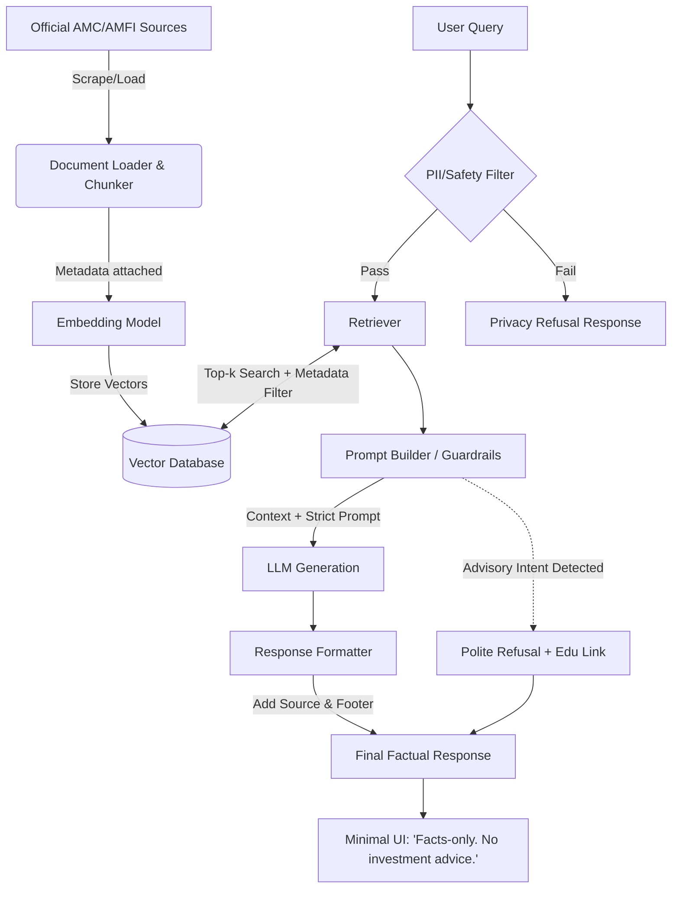

# Phase-Wise Architecture: Mutual Fund FAQ Assistant

This document outlines the detailed, phase-wise architecture for the Mutual Fund FAQ Assistant based on the problem statement requirements.

## Phase 1: Data Ingestion & Processing
**Objective:** Curate, process, and store the official corpus.

### 1.1 Source Selection & Scraping
*   **Target Corpus:** The project will exclusively use the following 5 URLs as the complete source corpus. No other URLs, PDFs, or external documents will be used.
    1. https://groww.in/mutual-funds/hdfc-mid-cap-fund-direct-growth 
    2. https://groww.in/mutual-funds/hdfc-equity-fund-direct-growth 
    3. https://groww.in/mutual-funds/hdfc-focused-fund-direct-growth 
    4. https://groww.in/mutual-funds/hdfc-elss-tax-saver-fund-direct-plan-growth 
    5. https://groww.in/mutual-funds/hdfc-large-cap-fund-direct-growth 
*   **Action:** Implement web scrapers or document loaders to fetch the HTML content and text exactly from these 5 specific URLs.

### 1.2 Data Cleaning & Extraction
*   **Extraction Tooling:** Use HTML parsers (e.g., BeautifulSoup, Cheerio, or Langchain WebBaseLoader) for extracting text and tabular data from the Groww web pages.
*   **Sanitization:** Remove irrelevant boilerplate, navigation menus, ads, and noisy headers/footers to ensure high data quality.

### 1.3 Text Chunking & Embedding
*   **Chunking Strategy:** Since the cleaned corpus consists of highly structured, relatively small Markdown files (~9KB each) with distinct headers (e.g., `## Holdings`, `### Minimum investments`, `### Exit Load`), use **Markdown Header-based Chunking** (e.g., LangChain's `MarkdownHeaderTextSplitter`). This ensures that specific financial metrics and their context remain perfectly intact within the same chunk.
*   **Embedding Model:** Select a reliable embedding model (e.g., OpenAI `text-embedding-3-small`, HuggingFace `all-MiniLM-L6-v2`) to convert text chunks into vector representations.

### 1.4 Vector Database
*   **Storage:** Store embeddings and critical metadata in a vector database (e.g., ChromaDB, Qdrant, Pinecone). Essential metadata based on our current data includes: `Source URL` (derived from filename), `Scheme Name` (from H1), and `Section Header` (extracted by the Markdown splitter, e.g., "Exit Load" or "Holdings").
*   **Index:** Configure similarity metrics (e.g., Cosine Similarity) for accurate and fast retrieval.

---

## Phase 2: RAG Pipeline & Core Logic
**Objective:** Build the retrieval mechanism and LLM generation logic with strict compliance guardrails.

### 2.1 User Query Processing
*   **Input Sanitization:** Filter out requests for PII (PAN, Aadhaar, account numbers, OTPs, emails).
*   **Query Formulation:** Process the user query to identify key entities (like specific mutual fund schemes or standard terms like "expense ratio").

### 2.2 Retrieval Strategy
*   **Self-Query Retriever (Metadata Pre-Filtering):** Before performing semantic search, use an LLM to parse the user's query and extract the specific mutual fund entity (`scheme_name`).
*   **Vector Search:** Apply a hard filter on the Vector DB using the extracted `scheme_name` metadata. Then, perform top-k Cosine Similarity search only across the filtered chunks. This guarantees zero hallucination or cross-contamination between different funds.
*   **Fallback:** If similarity scores are below a threshold, trigger a "Data Not Found" response rather than allowing the LLM to hallucinate.

### 2.3 Prompt Engineering & Guardrails
*   **System Prompt Requirements:**
    *   Strict instruction to answer *only* based on retrieved context.
    *   Constraint: Response must be exactly <= 3 sentences.
    *   Constraint: Must refuse advisory queries (e.g., "Which is better?", "Should I invest?").
*   **Refusal Logic:** Implement explicit prompt instructions or an intent classifier to detect advisory/speculative queries. Map these to predefined polite refusals reinforcing the facts-only nature of the bot and providing an AMFI/SEBI educational link.

### 2.4 LLM Generation
*   **Model Selection:** Use an instruction-tuned LLM configured with a temperature of 0.0 to ensure deterministic, factual outputs.
*   **Response Construction:** Assemble the final response by appending the required elements:
    *   The generated factual answer (max 3 sentences).
    *   The exactly one Source URL (extracted from context metadata).
    *   The footer: `“Last updated from sources: <date>”` (extracted from context metadata).

---

## Phase 3: User Interface & API Integration
**Objective:** Expose the assistant via a minimal, compliant user interface.

### 3.1 Backend API
*   **Framework:** FastAPI or Flask to serve the RAG pipeline.
*   **Endpoints:**
    *   `POST /chat`: Accepts user query, returns RAG response, source link, and footer.
    *   `GET /health`: System status.
*   **Statelessness:** Ensure the API does not store session data, chat history, or PII on the server, adhering to privacy constraints.

### 3.2 Frontend Application
*   **Framework:** Minimal React, Streamlit, or Vanilla HTML/JS.
*   **UI Components:**
    *   **Header:** Clear welcome message.
    *   **Disclaimer Banner:** Prominently display the mandated disclaimer: `“Facts-only. No investment advice.”`
    *   **Chat Interface:** Clean input box and chat history display.
    *   **Suggested Queries:** Three clickable example questions visible on load.
*   **Formatting:** Cleanly render the 3-sentence answers, with the source link and date footer visibly separated below the text.

---

## Phase 4: Validation & Deployment
**Objective:** Ensure the system meets accuracy and compliance criteria before release.

### 4.1 Testing & QA
*   **Factual Accuracy Testing:** Test with a golden dataset of objective questions to ensure correct data retrieval from factsheets and SIDs.
*   **Adversarial Testing:** Intentionally test with advisory prompts to verify the refusal logic is robust and cannot be easily bypassed.
*   **Constraint Verification:** Programmatically ensure responses are consistently 3 sentences or less and always include exactly one source link.

### 4.2 Deployment
*   **Hosting:** Deploy the backend API to a secure cloud provider and the frontend application to a CDN.
*   **Corpus Refresh:** Use **GitHub Actions** as an automated scheduler (cron job) to periodically trigger the Phase 1 ingestion pipeline, ensuring the Vector DB is continuously updated with the latest NAVs, SIDs, and factsheet data.

---

## Architecture Diagram Overview

